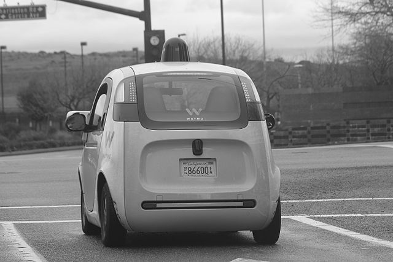

# High-Pass Filter

## Introduction
The **High-Pass Filter** is an essential component in self-driving car technology, specifically in image classification. This application helps detect object edges, allowing us to determine subsequent actions based on those edges.

[Check out a video on High-Pass Filters at Udacity.com](https://youtu.be/JOa9ZtV_rB4)

## What is a High-Pass Filter?
High-pass filters identify significant changes in intensity over a small area, making them effective for edge detection in grayscale images. These filters come in the form of **convolution kernels**, which are matrices that modify images by highlighting areas of intensity change. Below is an example of a high-pass kernel used for edge detection—a 3x3 kernel where all elements sum to zero.

This property is critical for edge detection, as the filter computes the difference between neighboring pixels, approximating the spatial derivative of the image.

## High-Pass Kernel Example
Applying a high-pass filter yields the following result:

## Convolution
During **convolution**, the 3x3 kernel is applied to each pixel of the grayscale image. The weights in the kernel are multiplied pairwise with the pixel values surrounding the center pixel, and their sum determines the new pixel value in the filtered image. 

This operation is integral to **convolutional neural networks (CNNs)**, which use multiple kernels to extract shape-based features and identify patterns in images. These networks are trained on large datasets, learning the most effective kernel weights for image classification.

Example of calculating a single output pixel value (175) during convolution:

### Edge Handling Techniques
When the filter overlaps the edges of the image, several techniques are employed to handle this:
- **Edge Extension:** Extending the edge pixel values outwards.
- **Zero Padding:** Padding the image with zeroes, though this can create darker borders in the output.

## Technology Stack
- **Programming Language:** Python
- **Environment:** Jupyter Notebook
- **Techniques:** Data Visualization, Machine Learning, AI, Localization, Prediction
- **Libraries:** OpenCV